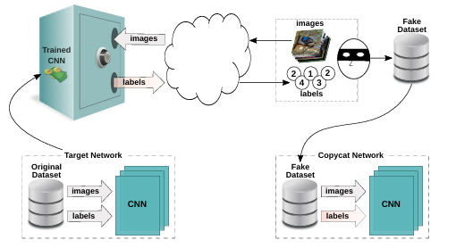
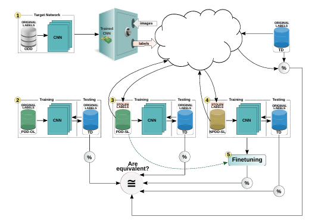

# 🔍 Copycat CNN Attack  
## Black-Box Model Extraction Under Strict Constraints

---

## 📌 1. Problem Background

Convolutional Neural Networks (CNNs) have achieved state-of-the-art performance in numerous computer vision applications, including:

- Image Classification  
- Object Detection  
- Facial Expression Recognition  
- Traffic Sign Recognition  

These models power modern AI-driven systems across industries.

However, developing high-performance CNN models requires:

- 📚 Large-scale labeled datasets  
- 💻 High computational resources (GPUs/TPUs)  
- 🧠 Expert architecture design and optimization  
- ⏳ Significant time and financial investment  

Because of these high costs, trained models are considered valuable intellectual property.

---

## 🔒 2. Black-Box Deployment Strategy

To protect proprietary models, organizations typically deploy them as **black-box systems**, accessible via APIs.

In this setting:

- Users submit input images  
- The API returns only the top-1 predicted class label (hard label)  
- Class probability distributions (soft labels) are hidden  
- Model architecture is confidential  
- Training data remains private  
- Model parameters are inaccessible  

The underlying assumption:

> Hiding internal details prevents unauthorized model replication.

However, this assumption may not hold.

---

## ⚠️ 3. Security Concern: Model Extraction

Recent research demonstrates that even black-box models may leak functional information through their prediction outputs.

An attacker can:

1. Query the model repeatedly  
2. Collect predicted labels  
3. Build a synthetic dataset  
4. Train a new model using these “stolen labels”  
5. Approximate the behavior of the original model  

This is known as a **Model Extraction Attack**.

---

## 🧠 4. Copycat CNN Core Idea

The Copycat CNN approach investigates a more constrained and realistic attack scenario:

- No access to soft labels  
- No knowledge of architecture  
- No access to original training data  
- No problem-domain labeled data  

Instead, the attacker uses:

- Random natural images (NPDD dataset)  
- Only the top-1 predicted class label  

These predictions are treated as **stolen labels**, forming a fake dataset to train a copycat CNN.

  

---

## 🔐 5. Black-Box Query Pipeline

The attacker interacts with the target model via API:

1. Submit random natural images  
2. Receive predicted labels  
3. Store (image, predicted label) pairs  
4. Construct fake dataset  
5. Train copycat model  

  

---

## 🔄 6. Complete Experimental Workflow

The experimental process consists of multiple stages:

### Step 1 – Train Target Network
The original CNN is trained using the legitimate labeled dataset.

### Step 2 – Generate Fake Dataset
Random natural images are queried to the target model and labeled using predicted outputs.

### Step 3 – Train Copycat CNN
A new CNN is trained using the stolen labels.

### Step 4 – Evaluate Performance
Both models are tested on the legitimate test dataset.

### Step 5 – Optional Fine-Tuning
Fine-tuning may be applied to improve performance.

  

---

## 🚫 7. Strict Attack Constraints

The attacker:

- ❌ Does not access original training dataset  
- ❌ Does not access problem-domain labeled data  
- ❌ Does not know model architecture  
- ❌ Does not receive class probabilities  
- ✅ Only queries the model and receives top-1 labels  

This makes the attack highly realistic and practical.

---

## 🎯 8. Research Objective

The primary objective of this project is to evaluate:

- Whether a deep CNN deployed as a black box can be replicated  
- How closely the copycat model approximates the target model  
- The feasibility of model extraction under strict constraints  

---

## 🚨 9. Security Implications

If successful, the Copycat CNN attack implies:

- Black-box deployment alone is insufficient protection  
- Deep learning systems are vulnerable to replication  
- Organizations risk intellectual property theft  
- AI security mechanisms must be strengthened  

Understanding this vulnerability is critical for developing robust and secure AI systems.
